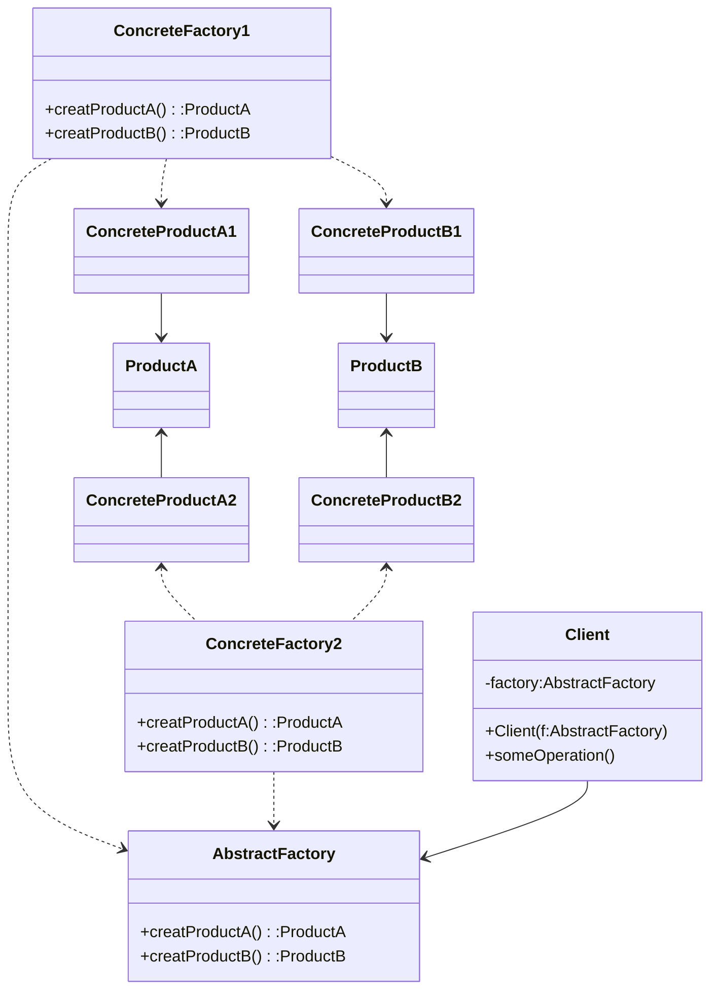

```mermaid
classDiagram
	ConcreteFactory1..>ConcreteProductA1
	ConcreteFactory1..>ConcreteProductB1
	ConcreteProductA1-->ProductA
	ConcreteProductB1-->ProductB
	ProductA<--ConcreteProductA2
	ProductB<--ConcreteProductB2
	ConcreteProductA2<..ConcreteFactory2
	ConcreteProductB2<..ConcreteFactory2
	ConcreteFactory1..>AbstractFactory
	ConcreteFactory2..>AbstractFactory
	Client-->AbstractFactory
	class ConcreteFactory1{
		+creatProductA():ProductA
		+creatProductB():ProductB
	}
	class ConcreteFactory2{
		+creatProductA():ProductA
		+creatProductB():ProductB
	}
	class AbstractFactory{
		+creatProductA():ProductA
		+creatProductB():ProductB
	}
	class Client{
		-factory:AbstractFactory
		+Client(f:AbstractFactory)
		+someOperation()
	}
```

