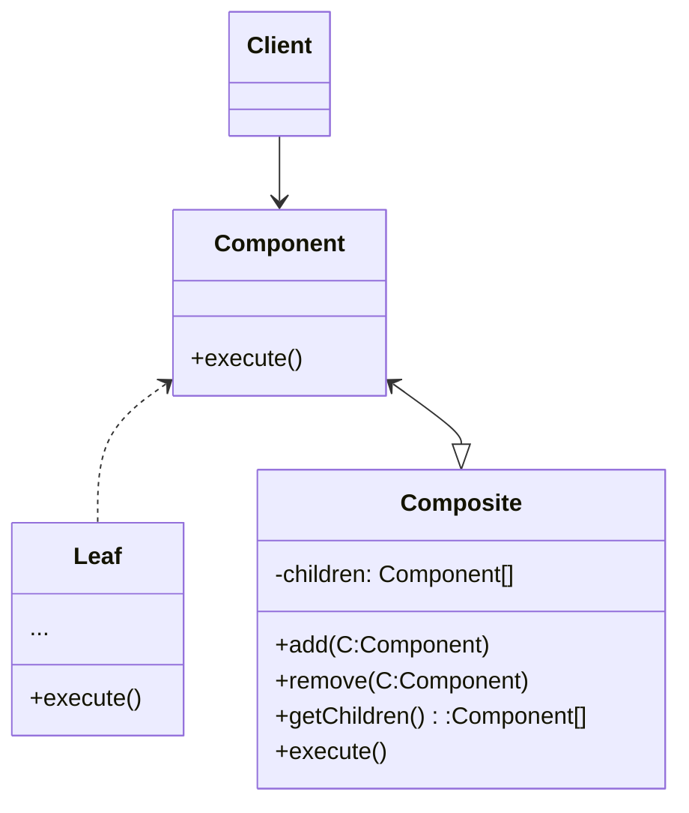

```mermaid
classDiagram
Client-->Component
Component<..Leaf
Component<--|>Composite

class Component{
	+execute()
}

class Leaf {
	...
	+execute()
}
class Composite{
	-children: Component[]
	+add(C:Component)
	+remove(C:Component)
	+getChildren():Component[]
	+execute()
}
```

