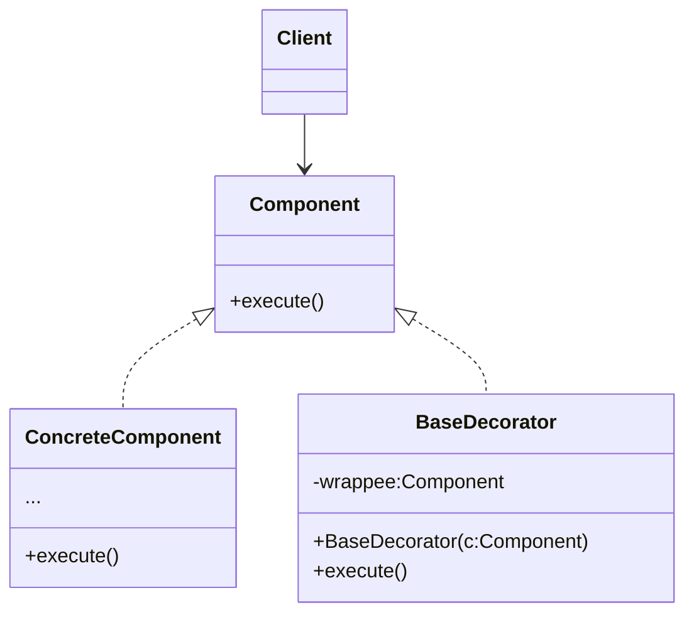

```mermaid
classDiagram
	Client-->Component
	Component<|..Concrete Component
	Component<|..Base Decorator
	
	class Component{
		+execute()
	}
	class Concrete Component{
		...
		+execute()
	}
	class Base Decorator{
		-wrappee:Component
		+BaseDecorator(c:Component)
		+execute()
	}
```

