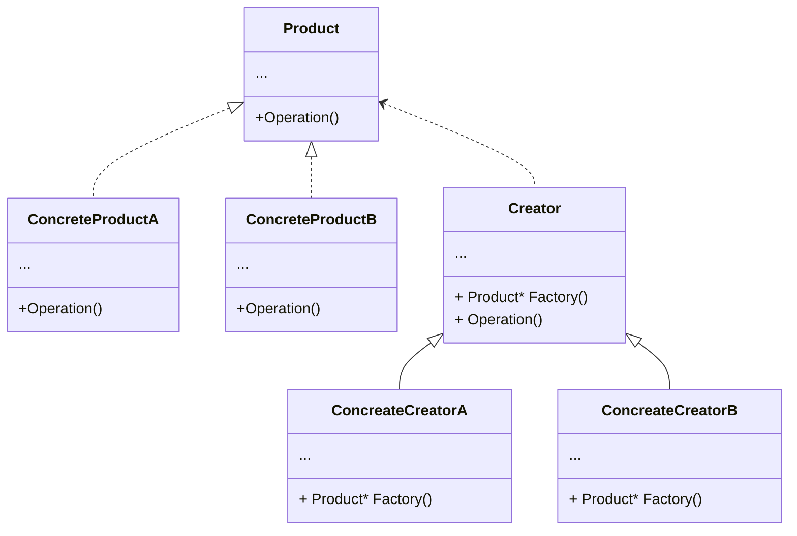

```mermaid
classDiagram
	Product<|..ConcreteProductA
	Product<|..ConcreteProductB
	class Product {
		...
		+Operation()
	}
	class ConcreteProductA {
		...
		+Operation()
	}
	class ConcreteProductB {
		...
		+Operation()
	}
	
	Product<..Creator
	Creator<|--ConcreateCreatorA
	Creator<|--ConcreateCreatorB
	
	class Creator {
		...
		+ Product* Factory()
		+ Operation()
	}
	class ConcreateCreatorA {
		...
		+ Product* Factory()
	}
	class ConcreateCreatorB {
		...
		+ Product* Factory()
	}
```

