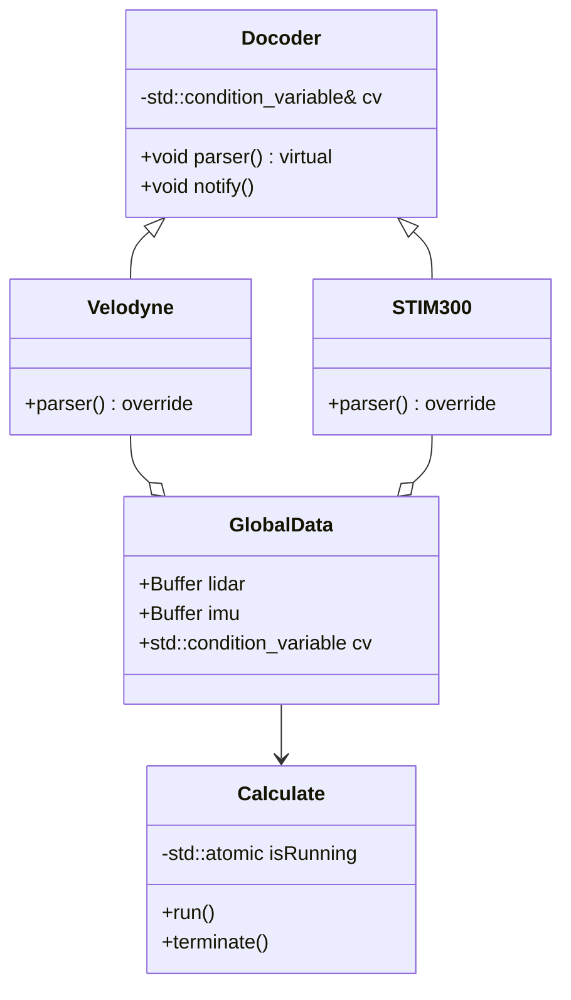

```mermaid
classDiagram
	Docoder<|--Velodyne
	Docoder<|--STIM300
	
	class Docoder{
		+void parser() virtual
		+void notify()
		-std::condition_variable& cv
	}
	
	class Velodyne{
		+parser() override
	}
	
	class STIM300{
		+parser() override
	}
	
	Velodyne --o GlobalData
	STIM300 --o GlobalData
	
	class GlobalData {
		+Buffer<LidarData> lidar
		+Buffer<ImuData> imu
		+std::condition_variable cv
	}
	
	GlobalData-->Calculate
	class Calculate {
		+run()
		+terminate()
		-std::atomic<bool> isRunning
	}
	
```

